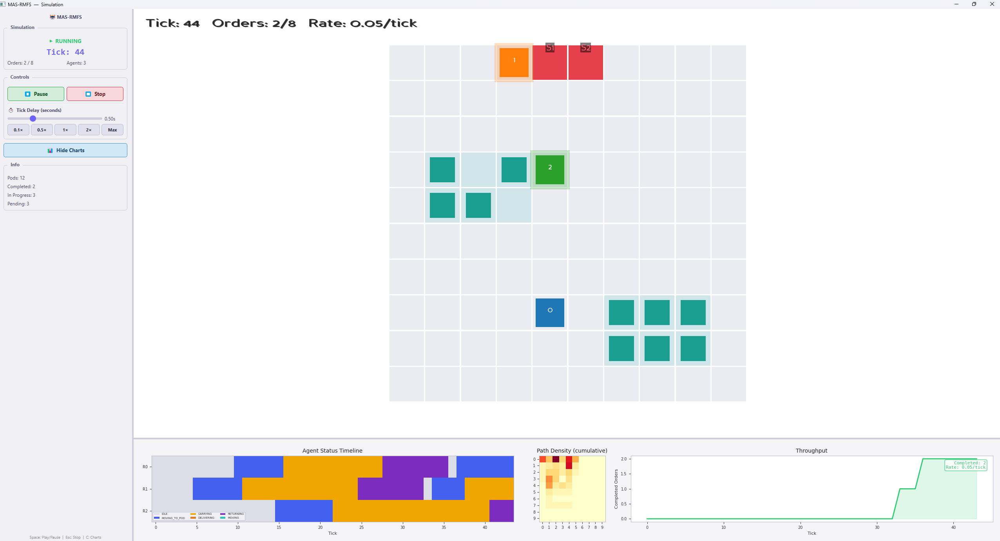
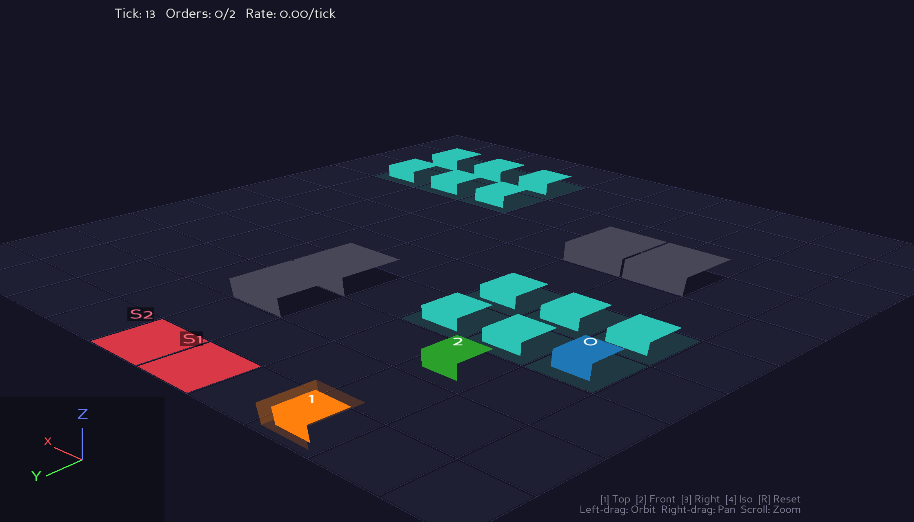
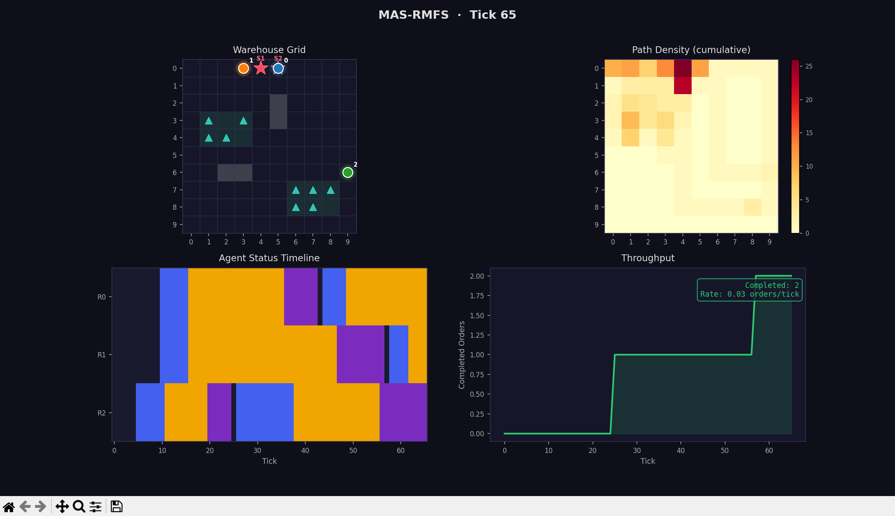

# 🤖 MAS-RMFS：多智能体机器人移动履行系统仿真

多智能体仓储机器人仿真平台，支持通过 JSON 配置文件灵活切换订单生成、路径规划与任务分配算法，无需修改源代码。

---

## 📑 目录

- [🏗️ 系统结构](#-系统结构)
- [🚀 运行方式](#-运行方式)
- [⚙️ 配置文件说明](#️-配置文件说明)
- [🔄 系统运行流程](#-系统运行流程)
- [🧩 如何集成自定义算法](#-如何集成自定义算法)
- [📦 已有算法列表](#-已有算法列表)
- [📼 订单录制与回放](#-订单录制与回放)
- [🎮 Panda3D 可视化](#-panda3d-可视化)
- [🧪 MAPF Benchmark 模式](#-mapf-benchmark-模式)
- [🧠 强化学习接口](#-强化学习接口)

---

## 🏗️ 系统结构

```
MAS_RMFS/
├── main.py                       # 程序入口：解析命令行参数、加载配置、实例化策略、启动引擎
├── Config/
│   ├── config_loader.py          # 配置加载器：解析 JSON → 数据类
│   └── default_config.json       # 默认配置文件
├── Engine/
│   └── simulation_engine.py      # 仿真引擎：主循环与 tick 调度
├── WorldState/                   # 世界状态（数据模型层）
│   ├── world.py                  # WorldState：聚合所有子状态
│   ├── map_state.py              # 地图：网格、障碍物、工作站、货架区
│   ├── agent_state.py            # 智能体：位置、路径、等待计数器
│   ├── pod_state.py              # 货架（Pod）：位置、归属、搬运状态、SKU 库存
│   ├── order_state.py            # 订单：SKU 需求、目标工作站
│   └── task_state.py             # 任务：PICK / DELIVER / RETURN
├── Policies/                     # 策略层（算法可插拔）
│   ├── policy_registry.py        # 策略注册中心
│   ├── OrderGenerator/           # 订单生成器
│   │   ├── base_order_generator.py
│   │   ├── RandomOrderGenerator/
│   │   ├── ZipfOrderGenerator/
│   │   └── RecordedOrderGenerator/  # 回放预录制订单
│   ├── PathPlanner/              # 路径规划器
│   │   ├── base_path_planner.py
│   │   ├── AStarPathPlanner/
│   │   └── PrioritizedPathPlanner/
│   ├── TaskAssigner/             # 任务分配器
│   │   ├── base_task_assigner.py
│   │   └── GreedyTaskAssigner/
│   ├── PodRetriever/             # SKU → Pod 检索器
│   │   ├── base_pod_retriever.py
│   │   └── DefaultPodRetriever/
│   ├── PodReturnPlanner/         # 货架归还规划器
│   │   ├── base_pod_return_planner.py
│   │   ├── HomeReturnPlanner/
│   │   └── NearestSlotPlanner/
│   ├── PodInitializer/           # 货架初始化策略
│   │   ├── base_pod_initializer.py
│   │   └── DefaultPodInitializer/
│   ├── ObservationEncoder/       # 🧠 RL 观测编码器
│   │   ├── base_observation_encoder.py
│   │   ├── GridObservationEncoder/
│   │   └── FlatObservationEncoder/
│   ├── ActionDecoder/            # 🧠 RL 动作解码器
│   │   ├── base_action_decoder.py
│   │   └── TaskAssignmentDecoder/
│   └── RewardFunction/           # 🧠 RL 奖励函数
│       ├── base_reward_function.py
│       └── DefaultRewardFunction/
├── OrderGenerateRecord/          # 订单录制工具
│   ├── recorder.py               # 录制脚本：生成订单并保存为 JSON
│   └── record/                   # 录制数据存放目录
│       └── orders.json           # 录制的订单数据
├── Visualization/                # 可视化
│   ├── visualizer.py             # 终端 ASCII / Matplotlib 仪表盘
│   ├── panda3d_visualizer.py     # Panda3D 2D/3D 可视化
│   └── ui.py                     # Qt 统一窗口（嵌入 Panda3D + 图表面板）
├── Env/                          # 🧠 强化学习环境
│   └── rmfs_env.py               # PettingZoo ParallelEnv 封装
└── Debug/
    └── logger.py                 # 日志工具
```

### 📋 核心模块职责

| 模块 | 📌 职责 |
|------|------|
| `Config` | 从 JSON 文件加载并验证配置参数 |
| `WorldState` | 维护仿真的全部状态（地图、智能体、货架、订单、任务） |
| `Engine` | 驱动仿真主循环，按固定顺序调用各策略 |
| `Policies` | 提供算法接口（抽象基类）和具体实现，通过注册中心按名称查找 |
| `Env` | PettingZoo 多智能体 RL 环境封装 |
| `Visualization` | 可选的实时可视化渲染 |

---

## 🚀 运行方式

```bash
# 使用默认配置运行（无可视化）
python main.py

# 使用 Matplotlib 仪表盘
python main.py --mpl

# 使用 Panda3D 可视化（2D 正交或 3D 透视，由配置决定）
python main.py --p3d

# 使用终端 ASCII 可视化
python main.py --visualize

# 指定自定义配置文件
python main.py --config path/to/my_config.json

# 🧠 使用 PettingZoo RL 环境
python -c "from Env.rmfs_env import RMFSEnv; env = RMFSEnv(); print(env.possible_agents)"

# 📼 录制订单（用于可复现实验）
python -m OrderGenerateRecord.recorder --order_amounts 100
python -m OrderGenerateRecord.recorder --generator ZipfOrderGenerator --zipf_param 1.5 --order_amounts 200

# 回放录制订单（在 default_config.json 中设置 use_recorded_orders=true）
python main.py --p3d
```

> `--mpl`、`--p3d`、`--visualize` 三者互斥，只能选择其一。

按 `Ctrl+C` 可安全停止仿真并输出统计摘要。

---

## ⚙️ 配置文件说明

配置文件为 JSON 格式，包含六个顶层节点：

```jsonc
{
    "map": {
        "rows": 10,                     // 网格行数
        "cols": 10,                     // 网格列数
        "obstacles": [[2,5], [3,5]],    // 障碍物坐标 [row, col]
        "stations": [                   // 工作站列表
            {"id": 1, "row": 0, "col": 4}
        ],
        "pod_zones": [                  // 货架区定义
            {"origin_row": 3, "origin_col": 1, "num_rows": 2, "num_cols": 3}
        ]
    },
    "robots": {
        "num_robots": 3,                // 机器人数量
        "starts": [[0,0], [0,1], [0,2]],// 各机器人初始位置
        "speed": 1
    },
    "pods": {
        "pod_types": ["A", "B", "C"],   // 货架类型列表
        "skus_per_pod": 3,              // 每个 Pod 存储的 SKU 种类数
        "sku_pool_size_per_type": 10,   // 每种类型的 SKU 池大小
        "items_per_sku": 50             // 每种 SKU 的初始库存量
    },
    "simulation": {
        "order_interval": 5,            // 每隔 N tick 生成订单
        "max_items_per_order": 2,       // 每个订单最多包含的 SKU 种类数
        "max_items_per_sku": 3,         // 订单中每种 SKU 需求的物品数量上限
        "fixed_order_size": true,       // true=固定 max_items_per_order 种 SKU
        "pickup_duration": 2,           // 拾取货架暂停 tick 数
        "dropoff_duration": 2,          // 放下货架暂停 tick 数
        "station_process_duration": 5,  // 工作站处理暂停 tick 数
        "tick_delay": 0.5,              // 每 tick 间隔秒数（0=全速）
        "task_execution_mode": "serial",// 任务执行模式："parallel"（多机器人）或 "serial"（单机器人）
        "p3d_view_mode": "3d",          // Panda3D 视角："2d" 或 "3d"
        "p3d_use_gpu": false,           // 🚀 启用 GPU 批量渲染/实例化
        "night_mode": true,             // 🌙 true=深色主题，false=白色主题
        "robot_label_scale": 0.25,      // Panda3D 机器人标签大小
        "show_selection_panel": true,    // 是否显示选中信息面板
        "show_robot_paths_panel": true,  // 是否显示机器人路径面板
        "log_level": "INFO",            // 日志级别
        "log_file": null,               // 日志输出文件（null=仅控制台）
        "use_recorded_orders": false,   // 📼 true=从文件读取预录制订单
        "recorded_orders_path": "",     // 📼 预录制订单 JSON 文件路径
        "immediate_dispatch": false     // 📼 true=忽略录制 tick，立即投放所有订单
    },
    "policies": {
        // 支持两种写法：
        // 写法一：仅指定算法名（使用默认参数）
        "task_assigner": "GreedyTaskAssigner",

        // 写法二：同时指定算法名和参数
        "order_generator": {
            "name": "ZipfOrderGenerator",
            "params": { "zipf_param": 1.5 }
        },
        "path_planner": {
            "name": "PrioritizedPathPlanner",
            "params": { "max_horizon": 100, "goal_reserve": 10 }
        },
        "pod_return_planner": "HomeReturnPlanner",
        "pod_initializer": "DefaultPodInitializer",
        "pod_retriever": "DefaultPodRetriever"
    },
    "robot_model": {
        "use_model": true,              // 是否使用 3D 机器人模型
        "body_offset_z": 0.008,         // 模型 Z 轴偏移
        "body_hpr": [90, 90, 90],       // 模型初始姿态 [H, P, R]
        "wheel_radius": 0.08,           // 轮子半径
        "wheel_positions": [            // 四轮位置 [x, y, z]
            [0.18, 0.14, 0.08],
            [0.18, -0.14, 0.08],
            [-0.18, 0.14, 0.08],
            [-0.18, -0.14, 0.08]
        ]
    }
}
```

### 📼 订单录制与回放

系统支持预录制订单用于可复现的消融实验：

| 参数 | 说明 |
|------|------|
| `use_recorded_orders` | 设为 `true` 时使用预录制订单替代实时生成 |
| `recorded_orders_path` | 录制文件路径（如 `./OrderGenerateRecord/record/orders.json`） |
| `immediate_dispatch` | 设为 `true` 时忽略录制的 tick 时间，在首个 tick 一次性投放全部订单。此模式自动强制 `task_execution_mode="serial"` |

### 🔄 任务执行模式

| 模式 | 说明 |
|------|------|
| `"serial"` | 每个订单的所有 Pod 由同一个机器人按顺序处理（PICK→DELIVER→RETURN→PICK→...） |
| `"parallel"` | 每个订单的不同 Pod 分配给不同的空闲机器人并行处理 |

---

## 🔄 系统运行流程

### 🟢 启动阶段（`main.py`）

```
1. 解析命令行参数（--config, --mpl, --visualize）
2. 调用 load_config() 加载 JSON 配置
3. import Policies      ← 触发所有算法的自动注册
4. get_policy() 按名称查找算法类
5. 实例化三大策略：OrderGenerator, TaskAssigner, PathPlanner
6. 创建 SimulationEngine 并调用 engine.run()
```

### 🔁 仿真主循环（`SimulationEngine._tick()`）

引擎按固定顺序在每个 tick 执行以下 8 个步骤：

```
┌─────────────────────────────────────────────────┐
│                 SimulationEngine.run()           │
│         while not shutdown:  _tick()             │
└────────────────────┬────────────────────────────┘
                     │
    ┌────────────────▼────────────────────┐
    │  Step 1: 生成订单                    │
    │  OrderGenerator.generate(world)      │
    │  → 返回新订单列表，加入 OrderState    │
    └────────────────┬────────────────────┘
                     │
    ┌────────────────▼────────────────────┐
    │  Step 2: 分配任务                    │
    │  TaskAssigner.assign(world)          │
    │  → 将订单拆分为 PICK/DELIVER/RETURN  │
    │    任务，分配给空闲智能体             │
    └────────────────┬────────────────────┘
                     │
    ┌────────────────▼────────────────────┐
    │  Step 3: 路径规划与任务激活           │
    │  _plan_and_activate(tick)            │
    │  → 对每个有任务但无路径的智能体调用    │
    │    PathPlanner.plan(agent, goal, world)│
    │  → 跳过等待中(is_waiting)的智能体     │
    └────────────────┬────────────────────┘
                     │
    ┌────────────────▼────────────────────┐
    │  Step 4: 移动智能体                  │
    │  _move_agents(tick)                  │
    │  → 每个智能体沿路径前进一步           │
    │  → 等待中的智能体不移动               │
    │  → 搬运中的货架跟随移动               │
    └────────────────┬────────────────────┘
                     │
    ┌────────────────▼────────────────────┐
    │  Step 5: 冲突检测                    │
    │  _detect_conflicts(tick)             │
    │  → 检测顶点冲突（两个智能体同位置）   │
    │  → 检测对向冲突（两个智能体交换位置）  │
    └────────────────┬────────────────────┘
                     │
    ┌────────────────▼────────────────────┐
    │  Step 6: 执行动作（含延时机制）       │
    │  _handle_actions(tick)               │
    │  → 到达目标后开始倒计时等待           │
    │  → 倒计时结束后执行 PICK/DELIVER/RETURN│
    └────────────────┬────────────────────┘
                     │
    ┌────────────────▼────────────────────┐
    │  Step 7: 检查订单完成                │
    │  _check_order_completion(tick)        │
    └────────────────┬────────────────────┘
                     │
    ┌────────────────▼────────────────────┐
    │  Step 8: 可视化渲染（可选）           │
    │  visualizer.render(world)            │
    └────────────────┬────────────────────┘
                     │
                world.advance_tick()
                     │
              ───回到 Step 1───
```

### 📦 任务生命周期

每个订单会被拆解为一组任务链，按顺序执行：

**串行模式**（`task_execution_mode: "serial"`）— 同一机器人依次处理所有 Pod：
```
Order(skus=[X, Y], station=S)  →  PodRetriever 查找 Pod
  │
  └─→ Agent #1: PICK(pod=A) → DELIVER(pod=A, station=S) → RETURN(pod=A)
                 → PICK(pod=B) → DELIVER(pod=B, station=S) → RETURN(pod=B)
```

**并行模式**（`task_execution_mode: "parallel"`）— 多个机器人同时处理不同 Pod：
```
Order(skus=[X, Y], station=S)  →  PodRetriever 查找 Pod
  │
  ├─→ Agent #1: PICK(pod=A) → DELIVER(pod=A, station=S) → RETURN(pod=A)
  └─→ Agent #2: PICK(pod=B) → DELIVER(pod=B, station=S) → RETURN(pod=B)
```

每个任务阶段：
1. **PICK（拾取）**：机器人移动到货架位置 → 暂停 `pickup_duration` tick → 拾起货架
2. **DELIVER（配送）**：机器人搬运货架到工作站 → 暂停 `station_process_duration` tick → 完成配送
3. **RETURN（归还）**：机器人将货架搬回原位 → 暂停 `dropoff_duration` tick → 放下货架

---

## 🧩 如何集成自定义算法

系统支持三种策略的自定义扩展：**订单生成器**、**路径规划器**、**任务分配器**。以下以添加新的路径规划器为例。

### 📁 第一步：创建算法子目录

在对应的类别文件夹下创建子目录：

```
Policies/PathPlanner/
  └── MyNewPlanner/
      ├── __init__.py
      └── my_new_planner.py
```

### ✏️ 第二步：实现算法类

继承对应的抽象基类，实现所有抽象方法：

```python
# Policies/PathPlanner/MyNewPlanner/my_new_planner.py

from Policies.PathPlanner.base_path_planner import BasePathPlanner

class MyNewPlanner(BasePathPlanner):
    """自定义路径规划器。"""

    def __init__(self, my_param: float = 1.0):
        self.my_param = my_param

    def plan(self, agent, goal, world_state):
        """
        计算从 agent.position 到 goal 的路径。

        参数：
            agent      - AgentState 对象（包含 position, carried_pod_id 等）
            goal       - 目标坐标 (row, col)
            world_state - WorldState 对象（包含地图、所有智能体状态等）

        返回：
            list[tuple[int, int]] - 路径坐标列表（不含起点），空列表表示未找到路径
        """
        # 在此实现你的路径规划算法
        path = []
        # ...
        return path
```

### 📤 第三步：创建 `__init__.py` 并导出

```python
# Policies/PathPlanner/MyNewPlanner/__init__.py

from .my_new_planner import MyNewPlanner
__all__ = ["MyNewPlanner"]
```

### 🔗 第四步：在类别 `__init__.py` 中注册

编辑 `Policies/PathPlanner/__init__.py`，添加导入和注册：

```python
from .MyNewPlanner import MyNewPlanner          # ← 新增

from Policies.policy_registry import register
register("path_planner", "MyNewPlanner", MyNewPlanner)  # ← 新增
```

### ✅ 第五步：在配置文件中启用

```json
{
    "policies": {
        "path_planner": {
            "name": "MyNewPlanner",
            "params": { "my_param": 2.5 }
        }
    }
}
```

完成！无需修改 `main.py` 或 `simulation_engine.py` 中的任何代码。

### 📐 四种策略的接口汇总

| 策略类型 | 基类 | 需实现的方法 | 方法签名 |
|---------|------|-------------|---------|
| 🛢️ 订单生成器 | `BaseOrderGenerator` | `generate()` | `generate(world_state) → list[Order]` |
| 📋 任务分配器 | `BaseTaskAssigner` | `assign()` | `assign(world_state) → list[Task]` |
| 🗺️ 路径规划器 | `BasePathPlanner` | `plan()` | `plan(agent, goal, world_state) → list[tuple]` |
| 📦 货架归还规划器 | `BasePodReturnPlanner` | `plan_return()` | `plan_return(pod, station_pos, world_state) → tuple` |
| 🔍 SKU→Pod 检索器 | `BasePodRetriever` | `retrieve()` | `retrieve(sku, world_state) → Pod` |
| 🏭 货架初始化器 | `BasePodInitializer` | `initialize()` | `initialize(pods, config) → None` |

### 🏭 策略注册中心工作原理

```python
# Policies/policy_registry.py 提供三个函数：

register(category, name, cls)    # 注册算法类
get_policy(category, name)       # 按名称查找算法类（找不到时抛出 ValueError 并列出可用选项）
list_policies(category=None)     # 列出已注册的算法
```

当 `main.py` 执行 `import Policies` 时，各 `__init__.py` 中的 `register()` 调用会自动触发，将所有算法注册到中央注册表。之后通过 `get_policy()` 按配置文件中的名称查找对应的类。

---

## 📦 已有算法列表

### 🛒 订单生成器（OrderGenerator）

| 算法名 | 说明 | 可配参数 |
|--------|------|---------|
| `RandomOrderGenerator` | 均匀随机选择货架生成订单 | — |
| `ZipfOrderGenerator` | 按 Zipf 分布选择货架（模拟热门商品） | `zipf_param`（偏斜度，默认 1.5） |
| `RecordedOrderGenerator` | 📼 回放预录制的 JSON 订单文件 | `recorded_orders_path`, `immediate_dispatch` |

### 🗺️ 路径规划器（PathPlanner）

| 算法名 | 说明 | 可配参数 |
|--------|------|---------|
| `AStarPathPlanner` | 单智能体 A* 算法 | — |
| `PrioritizedPathPlanner` | 优先级规划（时空 A* + 预留表） | `max_horizon`（搜索深度，默认 100）, `goal_reserve`（目标占用缓冲，默认 10） |

### 📋 任务分配器（TaskAssigner）

| 算法名 | 说明 | 可配参数 |
|--------|------|---------|
| `GreedyTaskAssigner` | 贪心分配：按距离选择最近的空闲智能体 | — |

### 📦 货架归还规划器（PodReturnPlanner）

| 算法名 | 说明 | 可配参数 |
|--------|------|---------|
| `HomeReturnPlanner` | 始终返回货架的原始位置（默认） | — |
| `NearestSlotPlanner` | 返回距工作站最近的空闲货架位 | — |

### 🔍 SKU → Pod 检索器（PodRetriever）

| 算法名 | 说明 | 可配参数 |
|--------|------|---------|
| `DefaultPodRetriever` | 选择距离最近且库存充足的 Pod | — |

### 🏭 货架初始化器（PodInitializer）

| 算法名 | 说明 | 可配参数 |
|--------|------|---------|
| `DefaultPodInitializer` | 按 pod_types 和 SKU 池随机分配库存 | — |

---

## 🧪 MAPF Benchmark 模式

系统内置 MovingAI 标准 MAPF 基准测试模式，可加载 `.map` / `.scen` 文件运行纯多智能体路径规划实验（无货架、无订单），用于与论文 baseline 直接对比。

### 运行方式

```bash
# 使用 benchmark 专用配置
python main.py --benchmark --config Config/benchmark_config.json

# 也可在任意配置中添加 benchmark 段，用 --benchmark 启用
python main.py --benchmark --config path/to/my_config.json
```

### 配置示例

在 JSON 配置文件中添加 `benchmark` 段：

```json
{
    "benchmark": {
        "enabled": true,
        "map_path": "Env/maps/warehouse-10-20-10-2-1.map",
        "scen_path": "",
        "num_agents": 20,
        "max_ticks": 1000,
        "random_seed": 42
    },
    "policies": {
        "path_planner": {
            "name": "AStarPathPlanner",
            "params": {}
        }
    }
}
```

路径规划器从 `policies.path_planner` 读取，可切换为任何已注册的 planner 进行对比实验。

### Agent 生成方式

| 方式 | 条件 | 说明 |
|------|------|------|
| **从 .scen 加载** | `scen_path` 非空 | 从 MovingAI .scen 文件读取 start/goal 坐标，取前 `num_agents` 个 |
| **随机生成** | `scen_path` 为空 | 在地图 free cell 上随机采样 start/goal，使用 `random_seed` 保证可复现 |

### 输出指标

| 指标 | 说明 |
|------|------|
| `Completed` | 到达目标的 agent 数 / 总 agent 数 |
| `Success rate` | 成功率 |
| `Makespan` | 最后一个 agent 到达目标的 tick 数 |
| `Total conflicts` | 仿真过程中检测到的顶点冲突与交换冲突总数 |

### 可用地图

`Env/maps/` 目录下包含 33 个标准 MovingAI 地图：

| 类别 | 地图 |
|------|------|
| 空地 | `empty-8-8`, `empty-16-16`, `empty-32-32`, `empty-48-48` |
| 随机障碍 | `random-32-32-10`, `random-32-32-20`, `random-64-64-10`, `random-64-64-20` |
| 迷宫 | `maze-32-32-2`, `maze-32-32-4`, `maze-128-128-1`, `maze-128-128-2`, `maze-128-128-10` |
| 房间 | `room-32-32-4`, `room-64-64-8`, `room-64-64-16` |
| 仓库 | `warehouse-10-20-10-2-1`, `warehouse-10-20-10-2-2`, `warehouse-20-40-10-2-1`, `warehouse-20-40-10-2-2` |
| 城市 | `Berlin_1_256`, `Boston_0_256`, `Paris_1_256` |
| 游戏 | `brc202d`, `den312d`, `den520d`, `lak303d`, `orz900d`, `ost003d` 等 |

> 完整的 benchmark 配置参数说明见 [`Config/benchmark_config_reference.md`](Config/benchmark_config_reference.md)。

---

## 🧠 强化学习接口

MAS-RMFS 提供基于 [PettingZoo](https://pettingzoo.farama.org/) 的多智能体并行环境（`ParallelEnv`），所有组件均可插拔替换。

### 🏗️ 架构

```
┌─────────────────────────────────────────────┐
│            RMFSEnv (PettingZoo ParallelEnv)     │
│                                                 │
│   reset() → obs_dict, info_dict                 │
│   step(actions) → obs, rewards, terms, truncs    │
│                                                 │
│   ┌───────────────────────────────────────┐ │
│   │  ObservationEncoder  │ ActionDecoder  │ │
│   │  RewardFunction     │ SimEngine      │ │
│   └───────────────────────────────────────┘ │
└─────────────────────────────────────────────┘
```

### 🚀 快速开始

```bash
# 安装依赖
pip install pettingzoo gymnasium
```

```python
from Env.rmfs_env import RMFSEnv

# 默认配置（GridObservationEncoder + TaskAssignmentDecoder + DefaultRewardFunction）
env = RMFSEnv(max_ticks=500)
obs, infos = env.reset()

for _ in range(500):
    # 每个智能体独立决策
    actions = {agent: env.action_space(agent).sample() for agent in env.agents}
    obs, rewards, terminations, truncations, infos = env.step(actions)
    if not env.agents:  # 回合结束
        break
```

### 🔧 自定义组件

```python
from Env.rmfs_env import RMFSEnv
from Policies.ObservationEncoder import FlatObservationEncoder
from Policies.RewardFunction import DefaultRewardFunction

env = RMFSEnv(
    config_path="Config/default_config.json",
    obs_encoder=FlatObservationEncoder(),      # 1D 向量，适用于 MLP
    reward_fn=DefaultRewardFunction(max_ticks=1000),
)
```

### 📦 可插拔组件一览

| 组件类型 | 实现 | 说明 |
|---------|------|------|
| 👁️ 观测编码 | `GridObservationEncoder` | 6 通道网格 `(R,C,6)` + 7 维智能体特征，适用于 CNN |
| | `FlatObservationEncoder` | 1D 展平向量，适用于 MLP |
| 🎯 动作解码 | `TaskAssignmentDecoder` | `Discrete(num_pods+1)` — 选择货架或空闲 |
| 🏆 奖励函数 | `DefaultRewardFunction` | +10/订单, -0.01/tick, +0.5/拾取 |

### 📊 观测空间说明（GridObservationEncoder）

**网格通道** `(rows, cols, 6)`：

| 通道 | 内容 |
|------|------|
| 0 | 障碍物 (1=障碍) |
| 1 | 工作站 (1=工作站) |
| 2 | 静止货架位置 |
| 3 | 智能体位置（归一化） |
| 4 | 搬运中的货架 |
| 5 | 待处理订单目标热力图 |

**智能体特征** `(7,)`： `[row, col, status, has_path, is_carrying, wait_ticks, tick]` — 均归一化到 [0,1]

### 🎮 动作空间说明（TaskAssignmentDecoder）

`Discrete(num_pods + 1)` — 每个智能体独立选择：
- **0** = 保持空闲（不执行任何操作）
- **1…N** = 选择去取对应 ID 的货架（自动创建 PICK → DELIVER → RETURN 任务链）

仅当智能体处于 IDLE 状态时动作才会生效。无效动作（货架不可用、无对应订单）会被安全忽略。

### ➕ 自定义 RL 组件

与现有策略的扩展方式一致：

```python
# 自定义观测编码器
from Policies.ObservationEncoder.base_observation_encoder import BaseObservationEncoder

class MyEncoder(BaseObservationEncoder):
    def observation_space(self, world_state):
        return gymnasium.spaces.Box(low=0, high=1, shape=(64,))

    def encode(self, world_state, agent_id):
        # 自定义编码逻辑
        return np.zeros(64)
```

---

## 📼 订单录制与回放

为了支持可复现的消融实验，系统提供订单预录制与回放功能。

### 📝 录制订单

使用 `OrderGenerateRecord/recorder.py` 脚本预先生成订单并保存为 JSON：

```bash
# 使用默认 RandomOrderGenerator 生成 100 个订单
python -m OrderGenerateRecord.recorder --order_amounts 100

# 使用 ZipfOrderGenerator 生成 200 个订单
python -m OrderGenerateRecord.recorder --generator ZipfOrderGenerator --zipf_param 1.5 --order_amounts 200

# 指定输出路径和自定义配置
python -m OrderGenerateRecord.recorder --config Config/default_config.json --output my_orders.json --order_amounts 50
```

录制文件格式示例：
```json
{
    "generator": "ZipfOrderGenerator",
    "total_orders": 100,
    "orders": [
        {
            "tick": 2,
            "sku_demands": {"A_SKU3": 2, "B_SKU1": 1},
            "station_id": 1
        }
    ]
}
```

### 🔄 回放订单

在配置文件中启用录制回放：

```json
"simulation": {
    "use_recorded_orders": true,
    "recorded_orders_path": "./OrderGenerateRecord/record/orders.json",
    "immediate_dispatch": false
}
```

**两种回放模式：**

| 模式 | `immediate_dispatch` | 行为 |
|------|---------------------|------|
| **按 tick 回放** | `false` | 按录制时的 tick 逐步投放订单（默认） |
| **立即投放** | `true` | 忽略录制 tick，在首个 tick 一次性投放全部订单，自动强制 `serial` 模式 |

---

## 🎮 Panda3D 可视化

使用 `--p3d` 标志启动 Panda3D 可视化窗口，支持 **2D 正交投影** 和 **3D 透视投影** 两种模式。

### 🔀 视角模式切换

通过配置文件中的 `p3d_view_mode` 参数切换：

```json
"simulation": {
    "p3d_view_mode": "3d",   // "2d" = 正交俯视，"3d" = 透视立体
    "tick_delay": 0.5         // 控制仿真速度（秒/tick）
}
```

### 📷 2D 模式

| 特性 | 说明 |
|------|------|
| 相机 | 正交投影，俯视全局 |
| 网格 | 平面色块（障碍物=灰色、工作站=红色、货架区=青影） |
| 货架 | 青色小方块，搬运时隐藏 |
| 机器人 | 彩色圆形 + ID 标签，搬运时显示发光环 |
| 鼠标 | 无交互 |

### 🌍 3D 模式

| 特性 | 说明 |
|------|------|
| 相机 | 透视投影，等距角度俯瞰 |
| 鼠标控制 | ⭐ **左键拖动** = 旋转，**右键拖动** = 平移，**滚轮** = 缩放 |
| 障碍物 | 立体方块，有高度感 |
| 地板 | 平铺色块 + 网格线 |
| 货架 | 3D 方块，浮在地板之上 |
| 机器人 | 3D 模型（可配置） + 发光环（搬运时），**朝向自动跟随行走方向** |
| 标签 | 🏷️ Billboard 效果，始终面向相机 |
| HUD | 📊 左上角显示 Tick / 订单数 / 完成率 |
| 坐标轴 | 🧭 左下角 3D 坐标系指示器（同步旋转） |
| 键盘快捷键 | ⌨️ `1`=俯视 `2`=正视 `3`=侧视 `4`=等距 `R`=重置 |

### 🔘 UI 控制面板功能

| 按钮 | 说明 |
|------|------|
| **Show Pod IDs** | 切换显示/隐藏货架编号标签 |
| **Color by Type** | 切换按货架类型（A=红色、B=蓝色、C=绿色）着色 |
| **Chart** | 打开/关闭统计图表面板 |

### 🏷️ 动态工作站标签

当机器人在工作站进行配送时，工作站标签会自动从 `S{id}` 切换为 `O{order_id}`，显示当前正在处理的订单编号。配送完成后自动恢复为工作站编号。

### 🤖 机器人模型朝向

当 `robot_model.use_model=true` 时，3D 机器人模型会自动旋转朝向行走方向。模型参数可在配置文件的 `robot_model` 节点中调整。


### 📝 TODO List

🔧 **超大规模下——多进程解耦架构**
```
如果仿真和渲染会互相拖慢，可以用 ZeroMQ 做进程间通信：
┌──────────────────┐    ZeroMQ (TCP/IPC)    ┌────────────────────┐
│ Python 仿真进程   │ ────────────────────▶ │ 渲染进程            │
│ (event_engine)   │    序列化 world_state   │ (Panda3D / Godot)  │
│ 纯逻辑计算        │ ◀───────────────────── │ GPU 渲染           │
│                  │    用户输入/控制命令     │ 原生桌面窗口        │
└──────────────────┘                        └─────────────────────┘

渲染端未来可以换成 任何引擎（Panda3D、Godot、甚至 C++ 自定义），只要它能读 ZeroMQ 消息。
```


### 🎬 DEMO (Current)
🔷 Simulation in 2D:

🔶 Simulation in 3D:

🟠 Simulation in 2D (achieved by matplotlib):


## 📄 License

[](https://opensource.org/licenses/Apache-2.0)

This project is licensed under the **Apache License 2.0**.

You are free to use, modify, and distribute this code for academic and commercial purposes.
However, you must include the original copyright notice, state any significant changes made
to the files, and include a copy of the license. This license also provides an express grant
of patent rights from contributors.

For more details, please refer to the [LICENSE](./LICENSE.txt) file in this repository.